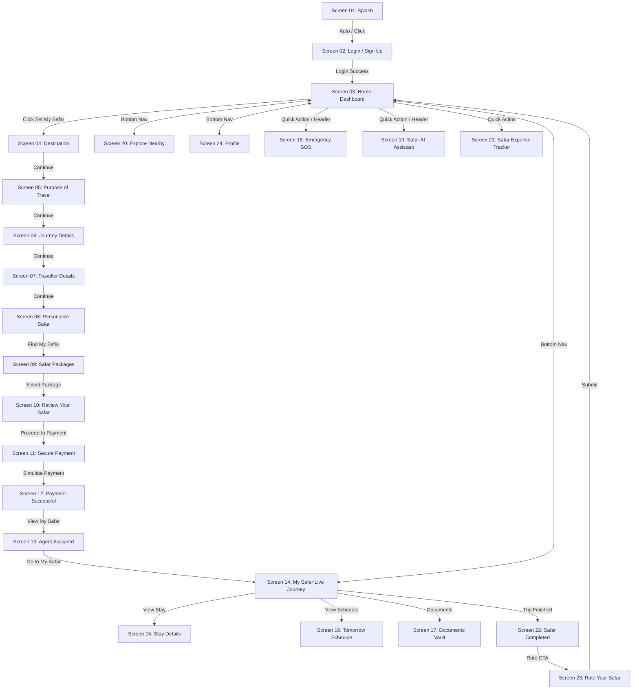
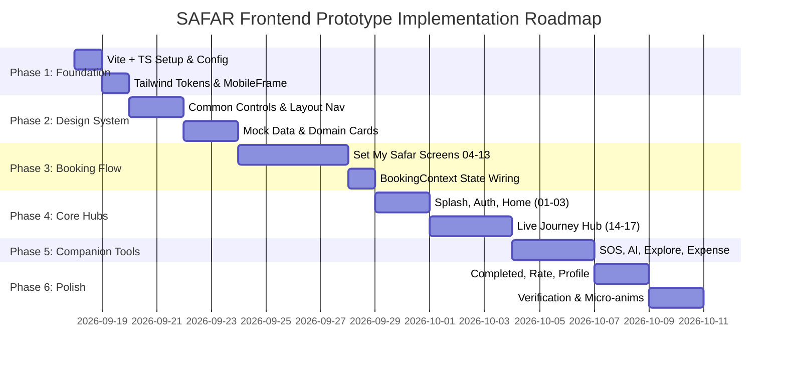

# SAFAR — Mobile Travel Companion Architecture & Technical Specification

> **Document Status**: Architectural Plan & Design Specification  
> **Target Version**: SAFAR Mobile Prototype v1.0  
> **Date**: September 2026  
> **Specification Reference**: [SAFAR_SPEC.md](file:///e:/Safar/SAFAR_SPEC.md)

---

## 1. Executive Summary & Tech Stack Recommendation

The **SAFAR** mobile travel companion app is designed as a high-fidelity, mobile-first frontend prototype adhering strictly to the *"Set My Safar"* brand vision. The application provides an end-to-end travel companion experience across **24 screens**, spanning trip planning, customization, package selection, payment simulation, live journey tracking, AI assistance, emergency SOS, budget tracking, and post-trip review.

### Recommended Technology Stack

| Layer | Recommended Technology | Rationale |
| :--- | :--- | :--- |
| **Frontend Framework** | **React 18** | Component-driven, scalable state management, rich ecosystem. |
| **Language** | **TypeScript** | Strict type safety for complex booking workflows, data models, and screen props. |
| **Build Tool & Dev Server**| **Vite** | Blazing fast HMR, optimized bundle creation, modern ES module support. |
| **Styling & Design System**| **Tailwind CSS** | Utility-first styling with custom design tokens (colors, typography, shadows, borders). |
| **Routing** | **React Router v6** | Declarative client-side routing supporting nested flows, parameters, and layout persistent shells. |
| **Icons** | **Lucide React** | Modern, clean vector icon set matching premium travel UI aesthetics. |
| **State Management** | **React Context + Hooks** | Lightweight, zero-dependency state orchestration for multi-step booking and live journey states. |

---

## 2. Project Folder Structure

The application will be organized with a clean, modular architecture separating layout containers, reusable UI elements, domain-specific card components, state management contexts, mock data, and feature screens:

```
safar-app/
├── public/
│   ├── favicon.ico
│   └── assets/
│       ├── icons/
│       └── images/
├── src/
│   ├── components/
│   │   ├── common/                 # Core design system primitives
│   │   │   ├── Button.tsx
│   │   │   ├── Card.tsx
│   │   │   ├── InputField.tsx
│   │   │   ├── SearchField.tsx
│   │   │   ├── LocationField.tsx
│   │   │   ├── DateSelector.tsx
│   │   │   ├── Dropdown.tsx
│   │   │   ├── RadioButton.tsx
│   │   │   ├── Checkbox.tsx
│   │   │   ├── Toggle.tsx
│   │   │   ├── StatusBadge.tsx
│   │   │   ├── ProgressIndicator.tsx
│   │   │   └── Rating.tsx
│   │   ├── layout/                 # Container & viewport shells
│   │   │   ├── MobileFrame.tsx     # Centered 390x844px mobile viewport container
│   │   │   ├── TopNavigation.tsx   # Header bar with back action & contextual title
│   │   │   └── BottomNavigation.tsx# Persistent 5-tab navigation bar with floating '+' CTA
│   │   └── domain/                 # High-level domain cards & feature UI
│   │       ├── DestinationCard.tsx
│   │       ├── PackageCard.tsx
│   │       ├── HotelCard.tsx
│   │       ├── AgentCard.tsx
│   │       ├── TimelineItem.tsx
│   │       ├── ChatBubble.tsx
│   │       ├── MapCard.tsx
│   │       ├── ExpenseCard.tsx
│   │       ├── DocumentCard.tsx
│   │       └── SosButton.tsx
│   ├── context/                    # Application global & flow states
│   │   ├── BookingContext.tsx      # Multi-step "Set My Safar" wizard state
│   │   ├── JourneyContext.tsx      # Active trip status & timeline orchestration
│   │   ├── AuthContext.tsx         # User authentication session state
│   │   └── ExpenseContext.tsx      # Safar budget & expense tracker state
│   ├── hooks/                      # Custom utility hooks
│   │   ├── useBooking.ts
│   │   ├── useJourney.ts
│   │   ├── useAuth.ts
│   │   └── useExpense.ts
│   ├── mock/                       # Fictional structured mock datasets
│   │   ├── userProfile.ts
│   │   ├── destinations.ts
│   │   ├── packages.ts
│   │   ├── liveJourney.ts
│   │   ├── agentData.ts
│   │   ├── hotelData.ts
│   │   ├── documentsData.ts
│   │   ├── nearbyPlaces.ts
│   │   └── aiResponses.ts
│   ├── pages/                      # All 24 Screen Components
│   │   ├── SplashScreen.tsx        # Screen 01
│   │   ├── AuthScreen.tsx          # Screen 02
│   │   ├── HomeScreen.tsx          # Screen 03
│   │   ├── booking/                # Set My Safar Flow Screens
│   │   │   ├── DestinationScreen.tsx     # Screen 04
│   │   │   ├── PurposeScreen.tsx         # Screen 05
│   │   │   ├── JourneyDetailsScreen.tsx  # Screen 06
│   │   │   ├── TravellerDetailsScreen.tsx# Screen 07
│   │   │   ├── PersonalizeScreen.tsx     # Screen 08
│   │   │   ├── PackagesScreen.tsx        # Screen 09
│   │   │   ├── ReviewScreen.tsx          # Screen 10
│   │   │   ├── PaymentScreen.tsx         # Screen 11
│   │   │   ├── PaymentSuccessScreen.tsx  # Screen 12
│   │   │   └── AgentAssignedScreen.tsx   # Screen 13
│   │   ├── journey/                # My Safar Live Journey Screens
│   │   │   ├── LiveJourneyScreen.tsx     # Screen 14
│   │   │   ├── StayDetailsScreen.tsx     # Screen 15
│   │   │   ├── ScheduleScreen.tsx        # Screen 16
│   │   │   ├── DocumentsScreen.tsx       # Screen 17
│   │   │   ├── CompletedScreen.tsx       # Screen 22
│   │   │   └── RateScreen.tsx            # Screen 23
│   │   ├── features/               # Companion Tool Screens
│   │   │   ├── EmergencySosScreen.tsx    # Screen 18
│   │   │   ├── SafarAiScreen.tsx         # Screen 19
│   │   │   ├── ExploreNearbyScreen.tsx   # Screen 20
│   │   │   └── ExpenseTrackerScreen.tsx  # Screen 21
│   │   └── ProfileScreen.tsx       # Screen 24
│   ├── services/                   # Service Layer (Mock implementations / API ready)
│   │   ├── apiConfig.ts
│   │   ├── authService.ts
│   │   ├── bookingService.ts
│   │   ├── aiService.ts
│   │   ├── mapsService.ts
│   │   └── expenseService.ts
│   ├── styles/                     # Design tokens & Global Tailwind CSS
│   │   └── globals.css
│   ├── types/                      # TypeScript definitions & data models
│   │   ├── booking.ts
│   │   ├── journey.ts
│   │   ├── user.ts
│   │   └── common.ts
│   ├── App.tsx                     # Main Router & Provider Tree
│   ├── main.tsx                    # Entry Point
│   └── index.css                   # Font imports & base resets
├── .env.example
├── index.html
├── package.json
├── tailwind.config.js
├── tsconfig.json
└── vite.config.ts
```

---

## 3. Complete Routing Structure (All 24 Screens)

Every screen specified in `SAFAR_SPEC.md` maps directly to a clean client-side route path in React Router:

| Screen # | Screen Title | Route Path | Component | Navigation Shell |
| :--- | :--- | :--- | :--- | :--- |
| **01** | Splash Screen | `/` | `SplashScreen.tsx` | Full Screen (No Nav) |
| **02** | Login / Sign Up | `/auth` | `AuthScreen.tsx` | Full Screen (No Nav) |
| **03** | Home Dashboard | `/home` | `HomeScreen.tsx` | Top Bar + Bottom Nav |
| **04** | Set My Safar: Destination | `/set-safar/destination` | `DestinationScreen.tsx` | Wizard Header (Step 1) |
| **05** | Purpose of Travel | `/set-safar/purpose` | `PurposeScreen.tsx` | Wizard Header (Step 2) |
| **06** | Journey Details | `/set-safar/details` | `JourneyDetailsScreen.tsx` | Wizard Header (Step 3) |
| **07** | Traveller Details | `/set-safar/traveller` | `TravellerDetailsScreen.tsx` | Wizard Header (Step 4) |
| **08** | Personalize Your Safar | `/set-safar/personalize` | `PersonalizeScreen.tsx` | Wizard Header (Step 4.5)|
| **09** | Safar Packages | `/set-safar/packages` | `PackagesScreen.tsx` | Wizard Header (Step 5) |
| **10** | Review Your Safar | `/set-safar/review` | `ReviewScreen.tsx` | Top Bar Back Button |
| **11** | Secure Payment | `/set-safar/payment` | `PaymentScreen.tsx` | Top Bar Back Button |
| **12** | Payment Successful | `/set-safar/success` | `PaymentSuccessScreen.tsx` | Full Screen Modal |
| **13** | Safar Agent Assigned | `/set-safar/agent-assigned` | `AgentAssignedScreen.tsx` | Top Bar Back Button |
| **14** | My Safar – Live Journey | `/my-safar` | `LiveJourneyScreen.tsx` | Top Bar + Bottom Nav |
| **15** | Stay Details | `/my-safar/stay` | `StayDetailsScreen.tsx` | Top Bar Back Button |
| **16** | Tomorrow's Schedule | `/my-safar/schedule` | `ScheduleScreen.tsx` | Top Bar Back Button |
| **17** | Documents Vault | `/my-safar/documents` | `DocumentsScreen.tsx` | Top Bar Back Button |
| **18** | Emergency SOS | `/emergency-sos` | `EmergencySosScreen.tsx` | Emergency Header |
| **19** | Safar AI Assistant | `/safar-ai` | `SafarAiScreen.tsx` | AI Header + Chat Bar |
| **20** | Explore Nearby | `/explore` | `ExploreNearbyScreen.tsx` | Search Header + Bottom Nav|
| **21** | Safar Expense Tracker | `/expenses` | `ExpenseTrackerScreen.tsx` | Top Bar Back Button |
| **22** | Safar Completed | `/my-safar/completed` | `CompletedScreen.tsx` | Celebration Screen |
| **23** | Rate Your Safar | `/my-safar/rate` | `RateScreen.tsx` | Feedback Header |
| **24** | Profile | `/profile` | `ProfileScreen.tsx` | Top Bar + Bottom Nav |

---

## 4. Reusable Component Architecture

To avoid code duplication and guarantee visual consistency, the UI will be built from modular, single-responsibility components:

### Common Primitives (`/src/components/common`)
- **`Button`**: Supports `primary` (`#2563EB`), `secondary`, `outline`, `ghost`, and `danger` variants, with loading, disabled, and icon slots.
- **`Card`**: Styled surface container with rounded corners (`16-20px`), subtle shadow, soft border, and hover/active states.
- **`InputField` / `SearchField` / `LocationField`**: Standardized input fields with icon prefixes, clear buttons, focus rings, error labels, and autocomplete suggestions.
- **`DateSelector`**: Mobile-optimized date picker control with predefined date formatting (`20 May 2026`).
- **`Dropdown` / `RadioButton` / `Checkbox` / `Toggle`**: Accessible interactive control primitives.
- **`StatusBadge`**: Visual tag for status indication (`LIVE` pulsing green badge, `COMPLETED`, `RECOMMENDED`, `UPCOMING`).
- **`ProgressIndicator`**: 5-step dot/bar indicator displaying current step position during the *Set My Safar* booking wizard.
- **`Rating`**: Interactive star rating bar supporting fractional display and tap-to-rate.

### Layout Containers (`/src/components/layout`)
- **`MobileFrame`**: Enforces a centered **390 × 844 px** mobile viewport wrapper on desktop screens with rounded frame edges and phone status bar simulation, rendering natively full-screen on actual mobile viewports.
- **`TopNavigation`**: Standard header rendering dynamic screen title, back button (`navigate(-1)`), and optional action buttons (e.g., share, document add, search).
- **`BottomNavigation`**: Persistent 5-action bottom bar featuring:
  1. `Home` (Grid icon)
  2. `My Safar` (Compass icon)
  3. `Set My Safar` (Prominent central floating '+' CTA with primary blue gradient)
  4. `Alerts` (Bell icon)
  5. `Profile` (User icon)

### Domain Components (`/src/components/domain`)
- **`DestinationCard`**: Displays travel destination image, title, weather summary, and quick action.
- **`PackageCard`**: Package tier display (Basic ₹499/day, Standard ₹799/day RECOMMENDED, Premium ₹1299/day) with feature checklist and select button.
- **`HotelCard`**: Hotel summary card featuring rating, check-in/out dates, thumbnail, and directions CTA.
- **`AgentCard`**: Agent profile card showing agent photo, name (Arjun Sharma), rating (⭐4.9), languages spoken, stats, and Call/Chat quick buttons.
- **`TimelineItem`**: Journey step timeline node showing state (`Completed ✓`, `Active ●`, `Upcoming ○`), timestamp, and event description.
- **`ChatBubble`**: User and Safar AI chat bubbles formatted with markdown support and quick action pills.
- **`MapCard`**: Interactive placeholder map card showing route line or nearby category pins.
- **`ExpenseCard`**: Category expense bar with budget spent calculation and progress color coding.
- **`SosButton`**: Specialized press-and-hold (3-second count) button with animated ring feedback for SOS activation.

---

## 5. Design Token Structure

All design tokens directly map the specifications in `SAFAR_SPEC.md` to Tailwind CSS configuration tokens (`tailwind.config.js`):

```javascript
// tailwind.config.js snippet
module.exports = {
  content: ['./index.html', './src/**/*.{js,ts,jsx,tsx}'],
  theme: {
    extend: {
      colors: {
        safar: {
          primary: '#2563EB',   // Primary Blue
          dark: '#0F172A',      // Dark Slate
          bg: '#F8FAFC',        // Light Background
          white: '#FFFFFF',     // Pure White
          success: '#16A34A',   // Success Green
          warning: '#F59E0B',   // Warning Amber
          error: '#DC2626',     // Danger/Error Red
          accent: '#3B82F6',    // Gradient Accent
        }
      },
      fontFamily: {
        sans: ['Inter', 'system-ui', 'sans-serif'],
      },
      fontSize: {
        'heading-lg': ['26px', { lineHeight: '32px', fontWeight: '700' }],
        'heading-md': ['20px', { lineHeight: '26px', fontWeight: '600' }],
        'body-base': ['15px', { lineHeight: '22px', fontWeight: '400' }],
        'btn-text': ['16px', { lineHeight: '20px', fontWeight: '600' }],
        'label-sm': ['13px', { lineHeight: '18px', fontWeight: '500' }],
      },
      spacing: {
        'px-screen': '24px',    // Standard horizontal screen padding
      },
      borderRadius: {
        'safar-card': '16px',
        'safar-btn': '12px',
        'safar-pill': '9999px',
      },
      boxShadow: {
        'safar-soft': '0 4px 20px -2px rgba(15, 23, 42, 0.06)',
        'safar-card': '0 8px 30px rgba(37, 99, 235, 0.08)',
        'safar-floating': '0 12px 35px rgba(37, 99, 235, 0.25)',
      }
    },
  },
  plugins: [],
}
```

---

## 6. Mock Data Architecture

The application uses clean, strongly-typed fictional sample datasets stored in `/src/mock/` to emulate backend data responses without invoking real external APIs:

```typescript
// Example TypeScript interfaces (/src/types/booking.ts)

export interface JourneyBooking {
  id: string;
  fromLocation: string;       // e.g. "Kolkata, West Bengal"
  toLocation: string;         // e.g. "Delhi"
  travelDate: string;         // e.g. "20 May 2026"
  preferredTime: string;      // e.g. "10:30 AM"
  purpose: 'Work' | 'Interview' | 'Education' | 'Medical' | 'Event' | 'Vacation' | 'Personal' | 'Pilgrimage' | 'Other';
  travelMode: 'Train' | 'Flight' | 'Bus';
  bookingStatus: 'Already Booked' | 'Help Me Book';
  companyInfo?: {
    name: string;             // e.g. "ABC Technologies"
    location: string;         // e.g. "New Delhi"
  };
  traveller: {
    fullName: string;         // e.g. "Roshan Kumar"
    phone: string;
    email: string;
    dob: string;
    gender: string;
    emergencyContact: string;
    currentCity: string;
    idType: 'Aadhaar' | 'Passport' | 'Driving Licence';
    isVerified: boolean;
  };
  personalization: {
    budget: 'Budget' | 'Comfortable' | 'Premium';
    stayType: 'Hotel' | 'Hostel' | 'Guest House' | 'No Stay Needed';
    transportation: string[];
    preferences: string[];
  };
  packageSelected: {
    id: string;               // e.g. "standard-safar"
    name: string;             // e.g. "Standard Safar"
    pricePerDay: number;      // e.g. 799
    isRecommended: boolean;
  };
  pricing: {
    packageTotal: number;     // ₹1,598
    serviceFee: number;       // ₹100
    taxes: number;            // ₹90
    discount: number;         // ₹0
    grandTotal: number;       // ₹1,788
  };
  assignedAgent?: {
    name: string;             // "Arjun Sharma"
    rating: number;           // 4.9
    tagline: string;          // "Your personal travel buddy"
    languages: string[];      // ["English", "Hindi", "Bengali"]
    completedSafars: number;  // 100
    phone: string;
  };
}
```

---

## 7. Application State Structure for "Set My Safar" Flow

The multi-step booking experience is powered by `BookingContext.tsx` (`/src/context/BookingContext.tsx`), providing state persistence as users progress back and forth through screens 04 to 13:

```typescript
// /src/context/BookingContext.tsx conceptual outline
export interface BookingContextType {
  bookingData: JourneyBooking;
  currentStep: number;
  updateRouteDetails: (from: string, to: string, date: string, time: string) => void;
  updatePurpose: (purpose: JourneyBooking['purpose']) => void;
  updateJourneyDetails: (mode: JourneyBooking['travelMode'], status: JourneyBooking['bookingStatus'], company?: string) => void;
  updateTravellerDetails: (details: Partial<JourneyBooking['traveller']>) => void;
  updatePersonalization: (personalization: JourneyBooking['personalization']) => void;
  selectPackage: (packageId: string) => void;
  applyPromoCode: (code: string) => boolean;
  completePayment: (method: string) => Promise<boolean>;
  resetBooking: () => void;
}
```

---

## 8. Navigation Architecture



---

## 9. Future Integration Strategies

### A. Backend Connection Strategy (Node.js / Express / MongoDB)
1. **Service Layer Abstraction**: All screen components invoke abstraction functions in `/src/services/` (e.g., `bookingService.createBooking()`) rather than direct `fetch` calls.
2. **HTTP Client setup**: Configure a centralized `axios` instance in `/src/services/apiConfig.ts` with interceptors for attaching Bearer JWT tokens and standard error handling.
3. **API Endpoint Contract Mapping**:
   - `POST /api/v1/auth/login` & `POST /api/v1/auth/signup`
   - `POST /api/v1/bookings` (Creates new trip request)
   - `GET /api/v1/journeys/live` (Fetches current journey timeline & stay details)
   - `GET /api/v1/documents` (Retrieves encrypted document vault URLs)
   - `POST /api/v1/expenses` (Syncs newly added user expenses)

### B. Google Maps Integration Strategy
1. **Maps Wrapper**: Install `@react-google-maps/api` for rendering real interactive maps.
2. **Places Autocomplete**: Connect `LocationField` components to Google Places Autocomplete API for origin/destination search.
3. **Directions & Live Tracking**: Utilize `DirectionsRenderer` for rendering routes on `LiveJourneyScreen` (Screen 14) and pin clusters on `ExploreNearbyScreen` (Screen 20).
4. **Fallback Mock Layer**: During prototype development, static vector map cards (`MapCard.tsx`) with custom pin markers simulate map interactions cleanly without requiring API keys.

### C. Safar AI Integration Strategy
1. **Backend LLM Gateway Proxy**: Client sends user prompts to `POST /api/v1/ai/chat` on the backend server. The backend securely calls Google Gemini API or OpenAI API without exposing API keys to the browser.
2. **Streaming Responses**: Support Server-Sent Events (SSE) or WebSocket connections for real-time text streaming inside `ChatBubble`.
3. **Trip Context Awareness**: The prompt engine automatically injects current travel context (e.g., current city "Delhi", user hotel "Hotel XYZ", schedule) into system prompts for personalized recommendations.

---

## 10. Environment Variable Strategy

Create `.env.example` to document required frontend configuration variables:

```env
# Application Metadata
VITE_APP_NAME="SAFAR - Set My Safar"
VITE_APP_ENV="development"

# API & Backend Configuration (Future Integration)
VITE_API_BASE_URL="http://localhost:5000/api/v1"
VITE_ENABLE_MOCK_DATA="true"

# Third-party Keys (Only public client keys; NO backend secret keys)
VITE_GOOGLE_MAPS_API_KEY=""
```

*Rule*: Any variable exposed to the frontend MUST start with `VITE_`. Sensitive keys (LLM secret keys, payment gateway secret keys, database credentials) MUST NEVER be placed in the frontend codebase.

---

## 11. Security & Compliance Considerations

1. **Zero Exposure of Real Secrets**: No real API keys, credentials, or secret keys in source code or commits.
2. **Placeholder Sensitivity**: Sensitive fields (card numbers, Aadhaar/Passport numbers, emergency contacts) use fictional masked placeholders only (e.g., `+91 XXXXX XXXXX`).
3. **Input Sanitization**: All input fields validate types and sanitize strings before updating state to prevent XSS.
4. **Simulated Payment Safety**: Payment simulation does not gather or transmit financial data.

---

## 12. Implementation Plan Phases



### Summary of Phases

- **Phase 1: Project Setup & Core Infrastructure**
  - Initialize Vite React TypeScript project.
  - Configure Tailwind CSS design tokens (`#2563EB`, custom fonts, border radii, shadows).
  - Build `MobileFrame` wrapper (390 x 844 px responsive container).
  - Set up React Router v6 shell.

- **Phase 2: Design System & Mock Data Layer**
  - Implement common controls: `Button`, `InputField`, `LocationField`, `DateSelector`, `StatusBadge`, `ProgressIndicator`, `Rating`.
  - Implement layout headers: `TopNavigation`, `BottomNavigation`.
  - Create mock datasets: `destinations.ts`, `packages.ts`, `agent.ts`, `hotel.ts`, `documents.ts`, `nearbyPlaces.ts`.

- **Phase 3: "Set My Safar" Booking Flow (Screens 04 – 13)**
  - Build `BookingContext.tsx` to hold multi-step wizard state.
  - Implement Screens 04 (Destination), 05 (Purpose), 06 (Details), 07 (Traveller), 08 (Personalize), 09 (Packages), 10 (Review), 11 (Payment), 12 (Success), 13 (Agent Assigned).

- **Phase 4: Home, Auth, & Live Journey Hub (Screens 01 – 03, 14 – 17)**
  - Implement Screen 01 (Splash Screen with timer redirect), Screen 02 (Auth), Screen 03 (Home Dashboard).
  - Implement Screens 14 (My Safar Live Journey timeline), 15 (Stay Details), 16 (Tomorrow's Schedule), 17 (Documents Vault).

- **Phase 5: Companion Tools (Screens 18 – 21)**
  - Implement Screen 18 (Emergency SOS with 3-sec hold button), Screen 19 (Safar AI Assistant chat), Screen 20 (Explore Nearby map/list), Screen 21 (Expense Tracker with add expense modal).

- **Phase 6: Trip Completion, Profile, & Micro-Interactions (Screens 22 – 24)**
  - Implement Screen 22 (Safar Completed celebration), Screen 23 (Rate Your Safar), Screen 24 (Profile).
  - Polish animations (250-400ms transitions), tab switching, back buttons, responsive alignment, and full flow testing.
