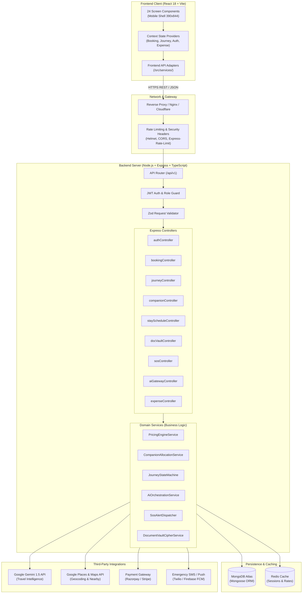
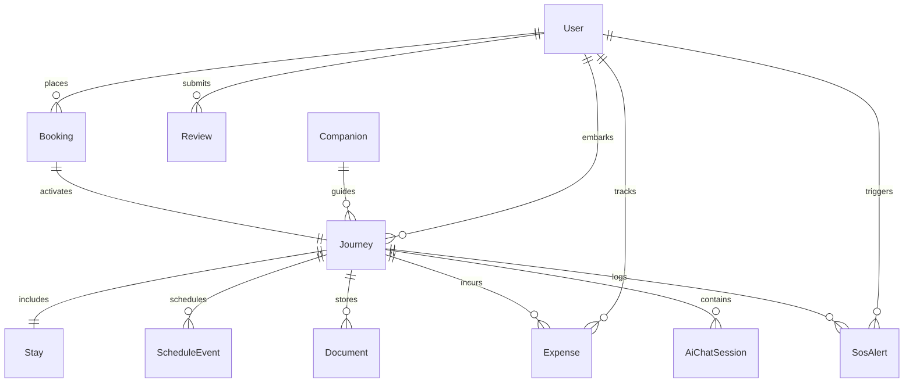
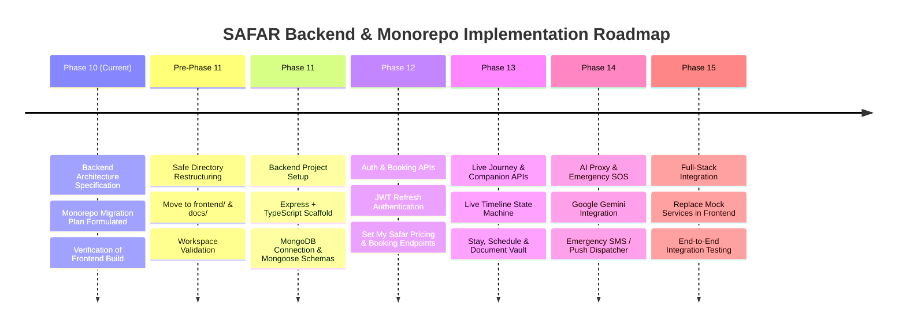

# SAFAR — Backend Architecture & Full-Stack Monorepo Specification

> **Document Status**: Complete Architectural Specification & Migration Plan (Phase 10)  
> **Target Version**: SAFAR Full-Stack Platform v1.0  
> **Date**: September 2026  
> **Related Documents**: [SAFAR_SPEC.md](file:///e:/Safar/docs/SAFAR_SPEC.md) | [SAFAR_ARCHITECTURE.md](file:///e:/Safar/docs/SAFAR_ARCHITECTURE.md)

---

## 1. Executive Summary & Backend Objectives

The **SAFAR** platform is a smart travel companion tailored for Indian travel scenarios, guiding users through complete end-to-end journeys across 24 distinct screens: trip discovery, purpose-driven customization, multi-step booking, secure payment simulation, live stage-by-stage journey tracking, stay and schedule management, encrypted document vaulting, one-touch emergency SOS dispatch, AI travel advisory, and trip expense tracking.

Having successfully established and validated the frontend prototype through Phases 1–8 (React 18, TypeScript, Vite 6, Tailwind CSS), **Phase 10 establishes the comprehensive Backend Architecture and Full-Stack Monorepo Migration Plan**.

### Core Backend Objectives

1. **Independent, Scalable Architecture**: Design an enterprise-grade, RESTful and event-driven backend utilizing **Node.js, Express, TypeScript, and MongoDB (via Mongoose)** that functions completely independently from the frontend.
2. **Domain-Driven API Contracts**: Expose clean, strongly typed endpoints that map directly to all 24 screens and their state contexts (`BookingContext`, `JourneyContext`, `AuthContext`, `ExpenseContext`).
3. **High Performance & Resilience**: Sub-100ms API response latency, connection pooling, indexing strategies, structured error handling, and offline-resilient sync data structures.
4. **Security & Data Privacy**: JWT authentication with refresh token rotation, bcrypt password hashing, role-based access control (User, Companion Agent, Admin), encrypted storage references for travel IDs/tickets, and strict payload validation (Zod/Joi).
5. **Zero-Breakage Monorepo Migration**: Define a systematic, risk-free plan to migrate the existing working frontend into a dedicated `frontend/` directory, prepare the parallel `backend/` directory, and consolidate project architecture specifications under `docs/`.

---

## 2. Target Monorepo Architecture

The final SAFAR repository enforces a strict, clean separation of concerns:

```
ProjectSafar/
│
├── frontend/                     # Client application (React 18 + Vite 6 + Tailwind CSS)
│   ├── src/
│   │   ├── components/           # Common UI primitives, layout frames, domain cards
│   │   ├── context/              # React Context state management
│   │   ├── hooks/                # Custom domain hooks
│   │   ├── mock/                 # Mock datasets (fallback / offline)
│   │   ├── pages/                # All 24 Screen Components
│   │   ├── services/             # API client & backend service adapters
│   │   ├── styles/               # Tailwind design tokens & globals
│   │   ├── types/                # Frontend TypeScript interfaces
│   │   ├── App.tsx               # Root router & layout shell
│   │   ├── main.tsx              # Application entry point
│   │   └── index.css             # Base styles & typography
│   ├── public/                   # Static icons, svgs, assets
│   ├── index.html                # Vite HTML entry point
│   ├── package.json              # Frontend package manifest & scripts
│   ├── postcss.config.js         # PostCSS configuration
│   ├── tailwind.config.js        # Tailwind CSS design system tokens
│   ├── tsconfig.json             # Frontend TypeScript compiler options
│   ├── tsconfig.node.json        # Node configuration for Vite
│   ├── vite.config.ts            # Vite bundler & dev server config
│   └── .env.example              # Frontend environment variables template
│
├── backend/                      # Server application (Node.js + Express + MongoDB + TypeScript)
│   ├── src/
│   │   ├── config/               # Environment, database, logger, & security config
│   │   ├── controllers/          # HTTP request handlers & response formatting
│   │   ├── middleware/           # Auth, RBAC, error handling, rate limiting
│   │   ├── models/               # Mongoose schemas & TypeScript document types
│   │   ├── routes/               # Express API route declarations
│   │   ├── services/             # Core business logic, pricing, & allocation engines
│   │   ├── validators/           # Request schema validation (Zod schemas)
│   │   ├── utils/                # Custom error classes, helpers, token utilities
│   │   ├── app.ts                # Express application factory & middleware stack
│   │   └── server.ts             # Server entry point & graceful shutdown hooks
│   ├── package.json              # Backend package manifest & scripts
│   ├── tsconfig.json             # Backend TypeScript compiler options
│   └── .env.example              # Backend environment variables template
│
├── docs/                         # Centralized architectural & technical documentation
│   ├── SAFAR_SPEC.md             # Functional product specification (24 screens)
│   ├── SAFAR_ARCHITECTURE.md     # Frontend architecture & UI design system
│   └── SAFAR_BACKEND_ARCHITECTURE.md # Backend architecture & monorepo migration plan
│
├── .gitignore                    # Root Git ignore rules (node_modules, dist, .env)
├── package.json                  # Root npm workspaces manifest & orchestration scripts
└── README.md                     # Comprehensive project overview & setup guide
```

### Architectural Principles

- **Zero Coupling**: Frontend and backend maintain distinct `package.json` manifests, dependency trees, and TypeScript configurations. Neither imports code directly from the other's directory.
- **Contract-Driven Communication**: All communication occurs exclusively over HTTP/HTTPS REST APIs and WebSocket/SSE real-time streams using documented JSON payloads.
- **Independent Deployability**: The frontend can be deployed to CDN edges (Vercel, Netlify, Cloudflare Pages), while the backend deploys to containerized environments (AWS ECS, Render, Railway, DigitalOcean App Platform) connecting to MongoDB Atlas.

---

## 3. High-Level Architectural Topology



---

## 4. Backend Layered Architecture (`backend/src/`)

The backend codebase adopts a modular, 4-tier layered architecture designed for maintainability, unit testability, and clear separation of responsibilities:

### 1. Configuration Layer (`src/config/`)
- `db.ts`: Mongoose connection lifecycle manager with auto-reconnect, replica set support, and graceful shutdown.
- `env.ts`: Typed environment variable parser validating `process.env` via Zod at server startup.
- `logger.ts`: Winston/Morgan structured logger supporting JSON formatting, log levels, and rotating file transports.
- `constants.ts`: Application-wide status codes, error strings, pricing tables, and default companion configurations.

### 2. HTTP Presentation Layer (`src/routes/`, `src/controllers/`, `src/middleware/`)
- **Routes (`src/routes/`)**: Mounts REST resources under `/api/v1/` with route-level middleware binding.
- **Controllers (`src/controllers/`)**: Thin presentation handlers that parse HTTP requests, extract parameters, invoke the corresponding domain service, and send standardized JSON responses.
- **Middleware (`src/middleware/`)**:
  - `authMiddleware.ts`: Verifies incoming JWT bearer tokens from headers or HTTP-only cookies.
  - `roleMiddleware.ts`: Enforces RBAC permissions (`user`, `companion_agent`, `admin`).
  - `validateMiddleware.ts`: Compiles and executes Zod schemas against `req.body`, `req.query`, and `req.params`.
  - `rateLimiter.ts`: Sliding-window IP rate limiter protecting against brute-force and DDoS attempts.
  - `errorHandler.ts`: Global uncaught error interceptor mapping `AppError` instances to standardized HTTP responses.

### 3. Business Logic Layer (`src/services/`)
- Encapsulates pure domain logic without dependencies on Express `req`/`res` objects:
  - `BookingService`: Handles draft creation, validation of travel parameters, promo code calculation, and price breakdowns.
  - `PricingEngineService`: Implements package tiered rates (Basic: ₹499/day, Standard: ₹799/day, Premium: ₹1,299/day), service charges, 5% GST taxes, and discount deduction.
  - `CompanionAllocationService`: Matches users with trained Safar travel companions (e.g., Arjun Sharma) based on route language compatibility, ratings, and current workload.
  - `JourneyService`: Governs the 6-stage active journey state machine (`PACKING`, `BOARDING`, `TRANSIT`, `MIDWAY`, `ARRIVAL`, `STAY_CHECKED_IN`).
  - `AiOrchestrationService`: Sanitizes user prompts, injects current trip context (destination, hotel, schedule), calls Google Gemini / LLM APIs, and formats markdown suggestions.
  - `SosAlertService`: Dispatches multi-channel alerts (SMS, push, companion notification) with lat/lng coordinates and user medical/identity context.
  - `DocumentVaultService`: Manages AES-256 metadata encryption and signed storage URLs for identity cards, train tickets, and hotel vouchers.

### 4. Data Access Layer (`src/models/`)
- Strongly typed Mongoose schemas with validation constraints, compound indexes, virtual getters, and lifecycle hooks (`pre('save')`, `post('save')`).

---

## 5. MongoDB Database Schemas & Data Modeling

The database schema design reflects the exact data structures and entities required across all 24 screens of the SAFAR frontend:



### Schema Specifications

#### 1. `User` Schema (`backend/src/models/User.ts`)
Supports Screen 02 (Auth), Screen 24 (Profile), and security context:
```typescript
interface IUser {
  _id: ObjectId;
  name: string;
  email: string;
  phone: string;
  passwordHash: string;
  avatarUrl: string;
  isVerified: boolean;
  emergencyContact: {
    name: string;
    relationship: string;
    phone: string;
  };
  currentCity: string;
  stats: {
    completedSafarsCount: number;
    citiesVisitedCount: number;
    averageRating: number;
  };
  role: 'user' | 'companion_agent' | 'admin';
  refreshTokenHash?: string;
  createdAt: Date;
  updatedAt: Date;
}
```
- **Indexes**: `{ email: 1 }` (unique), `{ phone: 1 }` (unique)

#### 2. `Booking` Schema (`backend/src/models/Booking.ts`)
Supports Screens 04–12 ("Set My Safar" booking wizard and payment):
```typescript
interface IBooking {
  _id: ObjectId;
  userId: ObjectId;
  bookingReference: string; // e.g., "SFR-2026-901234"
  fromLocation: string;     // e.g., "Kolkata (HWH)"
  toLocation: string;       // e.g., "New Delhi (NDLS)"
  travelDate: Date;         // e.g., 2026-05-20
  preferredTime: string;    // e.g., "10:30 AM"
  purpose: 'Work / Business' | 'Interview' | 'Education' | 'Health / Medical' | 'Event' | 'Vacation' | 'Family / Personal' | 'Pilgrimage' | 'Other';
  travelMode: 'Train' | 'Flight' | 'Bus';
  bookingStatus: 'Already booked my ticket' | 'Help me book my travel';
  companyName?: string;
  destinationInfo?: string;
  traveller: {
    fullName: string;
    phone: string;
    email: string;
    dob: Date;
    gender: 'Male' | 'Female' | 'Other';
    emergencyContact: string;
    currentCity: string;
    idType: 'Aadhaar' | 'Passport' | 'Driving Licence';
    idUploaded: boolean;
    idDocumentRef?: ObjectId;
  };
  personalization: {
    budget: 'Budget' | 'Comfortable' | 'Premium';
    stay: 'Hotel' | 'Hostel' | 'Guest House' | 'No Stay Needed';
    transportation: ('Metro' | 'Cab' | 'Public Transport' | 'Private Car')[];
    preferences: string[];
  };
  selectedPackage: {
    id: 'basic-safar' | 'standard-safar' | 'premium-safar';
    name: string;
    pricePerDay: number;
    durationDays: number;
  };
  pricing: {
    packageTotal: number;
    serviceFee: number;
    taxes: number;
    discount: number;
    grandTotal: number;
    promoCodeApplied?: string;
  };
  payment: {
    status: 'PENDING' | 'SUCCESS' | 'FAILED' | 'REFUNDED';
    method: 'upi' | 'card' | 'netbanking' | 'wallet';
    transactionId?: string;
    pnrNumber?: string;
    paidAt?: Date;
  };
  status: 'DRAFT' | 'CONFIRMED' | 'ACTIVE' | 'COMPLETED' | 'CANCELLED';
  createdAt: Date;
  updatedAt: Date;
}
```
- **Indexes**: `{ bookingReference: 1 }` (unique), `{ userId: 1, status: 1 }`, `{ travelDate: 1 }`

#### 3. `Journey` Schema (`backend/src/models/Journey.ts`)
Supports Screens 13, 14, 22 (Live Journey Hub, Companion, Completed):
```typescript
interface IJourney {
  _id: ObjectId;
  userId: ObjectId;
  bookingId: ObjectId;
  pnr: string;
  fromCity: string;
  toCity: string;
  departureDate: Date;
  departureTime: string;
  status: 'UPCOMING' | 'LIVE' | 'COMPLETED' | 'CANCELLED';
  currentStage: 'PACKING' | 'BOARDING' | 'TRANSIT' | 'MIDWAY' | 'ARRIVAL' | 'STAY_CHECKED_IN';
  timeline: {
    stageId: string;
    title: string;
    subtitle: string;
    scheduledTime: string;
    actualTime?: string;
    status: 'completed' | 'active' | 'upcoming';
    iconName: string;
  }[];
  companionId: ObjectId;
  stayId?: ObjectId;
  createdAt: Date;
  updatedAt: Date;
}
```
- **Indexes**: `{ userId: 1, status: 1 }`, `{ companionId: 1 }`, `{ pnr: 1 }`

#### 4. `Companion` Schema (`backend/src/models/Companion.ts`)
Supports Screen 13 (Agent Assigned) and live communication:
```typescript
interface ICompanion {
  _id: ObjectId;
  name: string;
  rating: number;
  tagline: string;
  languages: string[];
  completedSafars: number;
  avatarUrl: string;
  phone: string;
  greetingMessage: string;
  currentCity: string;
  isAvailable: boolean;
  activeJourneyIds: ObjectId[];
}
```

#### 5. `Stay` Schema (`backend/src/models/Stay.ts`)
Supports Screen 15 (Stay Details):
```typescript
interface IStay {
  _id: ObjectId;
  journeyId: ObjectId;
  hotelName: string;
  rating: number;
  city: string;
  address: string;
  checkInDate: Date;
  checkOutDate: Date;
  checkInTime: string;
  checkOutTime: string;
  imageUrl: string;
  phone: string;
  bookingReference: string;
  roomType: string;
  inclusions: string[];
  location: {
    lat: number;
    lng: number;
  };
}
```

#### 6. `Schedule` Schema (`backend/src/models/Schedule.ts`)
Supports Screen 16 (Tomorrow Schedule):
```typescript
interface ISchedule {
  _id: ObjectId;
  journeyId: ObjectId;
  date: Date;
  events: {
    _id: ObjectId;
    time: string;
    title: string;
    category: 'meal' | 'travel' | 'meeting' | 'explore' | 'hotel';
    location?: string;
    completed: boolean;
  }[];
}
```

#### 7. `Document` Schema (`backend/src/models/Document.ts`)
Supports Screen 17 (Documents Vault) with zero-plaintext file privacy:
```typescript
interface IDocument {
  _id: ObjectId;
  journeyId: ObjectId;
  userId: ObjectId;
  name: string;
  type: 'ticket' | 'hotel' | 'letter' | 'id' | 'insurance';
  issuedFor: string;
  fileSize: string;
  documentNumberMasked: string; // e.g. "XXXX-XXXX-4892"
  encryptedStorageKey: string;   // Reference to encrypted storage bucket
  mimeType: string;
  downloadUrlExpiry?: Date;
  createdAt: Date;
}
```

#### 8. `SosAlert` Schema (`backend/src/models/SosAlert.ts`)
Supports Screen 18 (Emergency SOS):
```typescript
interface ISosAlert {
  _id: ObjectId;
  userId: ObjectId;
  journeyId?: ObjectId;
  companionId?: ObjectId;
  triggeredAt: Date;
  coordinates: {
    latitude: number;
    longitude: number;
    accuracyMeters?: number;
  };
  status: 'TRIGGERED' | 'DISPATCHED' | 'ACKNOWLEDGED' | 'RESOLVED';
  notificationsDispatched: {
    target: 'COMPANION' | 'EMERGENCY_CONTACT' | 'SAFAR_HOTLINE';
    channel: 'SMS' | 'PUSH' | 'CALL';
    status: 'DELIVERED' | 'FAILED';
    timestamp: Date;
  }[];
  resolutionNotes?: string;
  resolvedAt?: Date;
}
```

#### 9. `Expense` Schema (`backend/src/models/Expense.ts`)
Supports Screen 21 (Expense Tracker):
```typescript
interface IExpense {
  _id: ObjectId;
  journeyId: ObjectId;
  userId: ObjectId;
  title: string;
  amount: number;
  category: 'Travel' | 'Stay' | 'Food' | 'Cab' | 'Shopping' | 'Other';
  date: Date;
  receiptUrl?: string;
  createdAt: Date;
}
```
- **Indexes**: `{ journeyId: 1, date: -1 }`, `{ userId: 1 }`

#### 10. `Review` Schema (`backend/src/models/Review.ts`)
Supports Screen 23 (Rate Your Safar):
```typescript
interface IReview {
  _id: ObjectId;
  journeyId: ObjectId;
  userId: ObjectId;
  overallRating: number;      // 1 to 5
  companionRating: number;    // 1 to 5
  stayRating?: number;        // 1 to 5
  selectedTags: string[];     // e.g. ["Punctual", "Helpful", "Clean Stay"]
  comment: string;
  createdAt: Date;
}
```

---

## 6. API Specification & Endpoint Contracts

All API endpoints follow RESTful conventions, prefixed with `/api/v1/`.

| Domain | Method | Endpoint | Screen Mapping | Description | Auth Required |
| :--- | :--- | :--- | :--- | :--- | :--- |
| **Auth** | `POST` | `/api/v1/auth/signup` | Screen 02 | Register new user account | No |
| **Auth** | `POST` | `/api/v1/auth/login` | Screen 02 | Authenticate and issue JWT tokens | No |
| **Auth** | `GET` | `/api/v1/auth/me` | App Shell | Get current authenticated user session | Yes |
| **Auth** | `POST` | `/api/v1/auth/refresh` | App Shell | Rotate and issue new access token | Cookie |
| **Booking** | `POST` | `/api/v1/bookings/draft` | Screens 04–08 | Create or update draft booking wizard state | Yes |
| **Booking** | `GET` | `/api/v1/bookings/packages` | Screen 09 | Fetch available Safar companion tiers | No |
| **Booking** | `POST` | `/api/v1/bookings/quote` | Screen 10 | Calculate itemized breakdown & taxes | Yes |
| **Booking** | `POST` | `/api/v1/bookings/promo` | Screen 10 | Validate promo code (e.g., `SAFAR100`) | Yes |
| **Booking** | `POST` | `/api/v1/bookings/checkout` | Screen 11 | Initiate payment simulation / gateway intent | Yes |
| **Booking** | `POST` | `/api/v1/bookings/verify` | Screen 12 | Verify payment receipt & generate PNR | Yes |
| **Journey** | `GET` | `/api/v1/journeys/live` | Screen 14 | Fetch active live journey timeline & status | Yes |
| **Journey** | `PATCH` | `/api/v1/journeys/:id/stage`| Screen 14 | Update timeline stage node status | Yes |
| **Companion**| `GET` | `/api/v1/companions/:id` | Screen 13 | Get assigned travel companion profile | Yes |
| **Stay** | `GET` | `/api/v1/stays/:journeyId` | Screen 15 | Get hotel reservation details & policies | Yes |
| **Schedule**| `GET` | `/api/v1/schedules/:journeyId`| Screen 16 | Fetch day itinerary & activity list | Yes |
| **Schedule**| `PATCH` | `/api/v1/schedules/events/:id`| Screen 16 | Toggle itinerary activity completion | Yes |
| **Document** | `GET` | `/api/v1/documents/:journeyId`| Screen 17 | Retrieve encrypted document vault list | Yes |
| **Document** | `POST` | `/api/v1/documents/upload` | Screen 17 | Upload ticket/ID voucher securely | Yes |
| **SOS** | `POST` | `/api/v1/sos/trigger` | Screen 18 | Trigger emergency SOS broadcast | Yes |
| **AI** | `POST` | `/api/v1/ai/chat` | Screen 19 | Context-aware AI assistant prompt proxy | Yes |
| **Places** | `GET` | `/api/v1/places/nearby` | Screen 20 | Explore nearby categorized amenities | Yes |
| **Expense** | `GET` | `/api/v1/expenses/:journeyId`| Screen 21 | List expenses & budget calculation | Yes |
| **Expense** | `POST` | `/api/v1/expenses` | Screen 21 | Add categorized travel expense | Yes |
| **Review** | `POST` | `/api/v1/reviews` | Screen 23 | Submit post-trip feedback & companion rating| Yes |
| **User** | `GET` | `/api/v1/users/profile` | Screen 24 | Fetch travel stats & profile info | Yes |

### Representative JSON Payloads

#### 1. Price Quote Request (`POST /api/v1/bookings/quote`)
```json
{
  "packageId": "standard-safar",
  "durationDays": 2,
  "promoCode": "SAFAR100"
}
```
**Response (200 OK):**
```json
{
  "success": true,
  "data": {
    "packageTotal": 1598,
    "serviceFee": 100,
    "taxes": 90,
    "discount": 100,
    "grandTotal": 1688,
    "promoValid": true,
    "currency": "INR"
  }
}
```

#### 2. Live Journey Response (`GET /api/v1/journeys/live`)
```json
{
  "success": true,
  "data": {
    "id": "jrn_8901234",
    "status": "LIVE",
    "pnr": "2458901234",
    "fromCity": "Kolkata",
    "toCity": "Delhi",
    "departureDate": "2026-05-20",
    "departureTime": "10:30 AM",
    "currentStage": "TRANSIT",
    "timeline": [
      { "id": "1", "title": "Trip Starts", "subtitle": "Bag packed, documents verified", "time": "08:00 AM", "status": "completed", "iconName": "Briefcase" },
      { "id": "2", "title": "Boarding", "subtitle": "Howrah Junction - Platform 9", "time": "10:00 AM", "status": "completed", "iconName": "Train" },
      { "id": "3", "title": "In Transit", "subtitle": "Train running on time (130 km/h)", "time": "02:30 PM", "status": "active", "iconName": "Navigation" },
      { "id": "4", "title": "Midway Station", "subtitle": "Kanpur Central (10 min halt)", "time": "06:15 PM", "status": "upcoming", "iconName": "Coffee" },
      { "id": "5", "title": "Arrival", "subtitle": "New Delhi Railway Station", "time": "10:30 PM", "status": "upcoming", "iconName": "MapPin" },
      { "id": "6", "title": "Check-in at Hotel", "subtitle": "Hotel XYZ, Connaught Place", "time": "11:15 PM", "status": "upcoming", "iconName": "Home" }
    ],
    "companion": {
      "id": "cmp_01",
      "name": "Arjun Sharma",
      "rating": 4.9,
      "tagline": "Your personal travel buddy",
      "phone": "+91 98765 43210"
    }
  }
}
```

---

## 7. Authentication, Authorization & Security Architecture

### Token Lifecycle & Session Management
- **Short-Lived Access Tokens**: Issued as HMAC-SHA256 signed JWTs with a 15-minute expiration window containing `userId`, `email`, and `role`.
- **Refresh Token Rotation**: Issued with a 7-day expiration window, stored as a cryptographically random SHA-256 hash in MongoDB and transmitted to the client inside an `HttpOnly`, `SameSite=Strict`, `Secure` cookie.
- **Revocation Capability**: Users logging out or changing credentials triggers immediate invalidation of stored refresh token hashes.

### Security Defenses
- **Data Protection at Rest**: Identity proof numbers (Aadhaar, Passport) and document references are encrypted via AES-256-GCM before database insertion.
- **Defensive HTTP Headers**: Powered by `helmet`, setting `Content-Security-Policy`, `X-Content-Type-Options: nosniff`, and `Strict-Transport-Security`.
- **NoSQL Injection Guard**: Sanitization via `express-mongo-sanitize` stripping malicious `$` or `.` operators from request payloads.
- **CORS White-listing**: Strictly allows incoming origins matching `VITE_APP_URL` (development: `http://localhost:3000`, production: custom domain).
- **Emergency SOS Prioritization**: Emergency triggers bypass standard rate limiting and invoke asynchronous SMS and push notifications via dedicated queue workers.

---

## 8. Frontend → Full-Stack Monorepo Migration Plan

This section provides the complete, authoritative guide to safely migrating the current root-level frontend into the target `ProjectSafar` full-stack monorepo structure.

### Migration Safety Rules
1. **Zero Downtime / Zero Breakage**: The working application must continue building and running without missing files, broken imports, or missing dependencies.
2. **Phase 10 Boundary**: Restructuring is documented in Phase 10. The actual file movements will be executed as a controlled implementation step before Phase 11.
3. **No Blind Moves**: Every single file has a designated origin, destination, and verification step.

---

### Step-by-Step Migration Analysis

```
CURRENT STRUCTURE (Root Frontend)
             ↓
TARGET STRUCTURE (Full-Stack Monorepo)
             ↓
FILES TO MOVE (Explicit Mapping Matrix)
             ↓
CONFIGURATION CHANGES (Root & Package Manifests)
             ↓
VALIDATION STEPS (Zero-Breakage Verification)
```

---

### 1. CURRENT STRUCTURE

Currently, the frontend files, configuration, and dependencies reside directly in the workspace root:

```
e:/Safar/
├── .env.example              # Frontend environment variables
├── .gitignore                # Single root gitignore
├── index.html                # Vite entry HTML
├── node_modules/             # Frontend dependencies
├── package.json              # Frontend package manifest ("name": "safar-mobile-app")
├── package-lock.json         # Lockfile
├── postcss.config.js         # PostCSS config
├── tailwind.config.js        # Tailwind CSS config
├── tsconfig.json             # Root TypeScript config
├── tsconfig.node.json        # Node TypeScript config
├── vite.config.ts            # Vite build config
├── README.md                 # Project documentation
├── SAFAR_SPEC.md             # Functional specification
├── SAFAR_ARCHITECTURE.md     # Frontend architecture specification
├── SAFAR_BACKEND_ARCHITECTURE.md # Backend architecture specification
└── src/
    ├── App.tsx
    ├── main.tsx
    ├── index.css
    ├── components/
    ├── context/
    ├── mock/
    ├── pages/
    └── types/
```

*Status Check*: Production build has been tested and verified clean (`tsc && vite build` built in 13.3s with 0 errors).

---

### 2. TARGET STRUCTURE

In the target structure, all frontend files reside in `frontend/`, backend files in `backend/`, and documentation in `docs/`, with workspace orchestration at the root:

```
ProjectSafar/
├── frontend/                     # Moved frontend directory
│   ├── src/
│   │   ├── components/
│   │   ├── context/
│   │   ├── hooks/
│   │   ├── mock/
│   │   ├── pages/
│   │   ├── services/
│   │   ├── styles/
│   │   └── types/
│   ├── public/
│   ├── index.html
│   ├── package.json
│   ├── postcss.config.js
│   ├── tailwind.config.js
│   ├── tsconfig.json
│   ├── tsconfig.node.json
│   ├── vite.config.ts
│   └── .env.example
│
├── backend/                      # Dedicated backend directory (Phase 11)
│   ├── src/
│   ├── package.json
│   ├── tsconfig.json
│   └── .env.example
│
├── docs/                         # Centralized architecture documents
│   ├── SAFAR_SPEC.md
│   ├── SAFAR_ARCHITECTURE.md
│   └── SAFAR_BACKEND_ARCHITECTURE.md
│
├── .gitignore                    # Monorepo-aware gitignore
├── package.json                  # Root npm workspaces manifest
└── README.md                     # Monorepo overview & instructions
```

---

### 3. FILES TO MOVE: Exhaustive Mapping Matrix

| Current Source Path | Action | Target Destination Path | Rationale |
| :--- | :--- | :--- | :--- |
| `src/` | **MOVE** | `frontend/src/` | Encapsulates all React application code |
| `index.html` | **MOVE** | `frontend/index.html` | Vite entry point for frontend SPA |
| `vite.config.ts` | **MOVE** | `frontend/vite.config.ts` | Frontend bundler configuration |
| `tailwind.config.js` | **MOVE** | `frontend/tailwind.config.js` | Frontend utility design tokens |
| `postcss.config.js` | **MOVE** | `frontend/postcss.config.js` | CSS processing pipeline |
| `tsconfig.json` | **MOVE** | `frontend/tsconfig.json` | Frontend TypeScript compiler options |
| `tsconfig.node.json`| **MOVE** | `frontend/tsconfig.node.json`| Vite Node TypeScript options |
| `.env.example` | **MOVE** | `frontend/.env.example` | Frontend-specific environment variables |
| `package.json` | **MOVE** | `frontend/package.json` | Retains frontend dependencies & dev dependencies |
| `package-lock.json`| **MOVE** | `frontend/package-lock.json` | Exact lockfile for frontend packages |
| `public/` (if created)| **MOVE**| `frontend/public/` | Static web assets |
| `dist/` | **DELETE** | *N/A (Git ignored)* | Build artifact, will be regenerated in `frontend/dist/` |
| `node_modules/` | **REGEN**| `frontend/node_modules/` | Re-installed cleanly inside workspace |
| `SAFAR_SPEC.md` | **KEEP/PLAN** | `docs/SAFAR_SPEC.md` | Architecture documentation |
| `SAFAR_ARCHITECTURE.md` | **KEEP/PLAN** | `docs/SAFAR_ARCHITECTURE.md` | Architecture documentation |
| `SAFAR_BACKEND_ARCHITECTURE.md` | **KEEP/PLAN** | `docs/SAFAR_BACKEND_ARCHITECTURE.md` | Architecture documentation |
| `README.md` | **STAYS AT ROOT** | `README.md` | Project-wide overview and launch instructions |
| `.gitignore` | **STAYS AT ROOT** | `.gitignore` | Updated with monorepo patterns |
| `package.json` | **CREATE NEW** | `package.json` (Root) | Monorepo workspaces manifest |

---

### 4. CONFIGURATION CHANGES

#### A. Root Monorepo `package.json` (To be created)
Enables concurrent execution and script delegation to sub-packages without manual directory navigation:
```json
{
  "name": "safar-monorepo",
  "version": "1.0.0",
  "private": true,
  "workspaces": [
    "frontend",
    "backend"
  ],
  "scripts": {
    "dev": "npm run dev --workspace=frontend",
    "dev:frontend": "npm run dev --workspace=frontend",
    "dev:backend": "npm run dev --workspace=backend",
    "dev:all": "concurrently -n \"FRONTEND,BACKEND\" -c \"blue,green\" \"npm run dev:frontend\" \"npm run dev:backend\"",
    "build": "npm run build --workspace=frontend",
    "build:frontend": "npm run build --workspace=frontend",
    "build:backend": "npm run build --workspace=backend",
    "preview": "npm run preview --workspace=frontend"
  },
  "devDependencies": {
    "concurrently": "^8.2.2"
  }
}
```

#### B. Frontend `frontend/package.json` (Moved & Updated)
Name updated to clearly signify frontend package:
```json
{
  "name": "safar-frontend",
  "private": true,
  "version": "1.0.0",
  "type": "module",
  "scripts": {
    "dev": "vite",
    "build": "tsc && vite build",
    "preview": "vite preview"
  },
  "dependencies": {
    "clsx": "^2.1.1",
    "lucide-react": "^0.475.0",
    "react": "^18.3.1",
    "react-dom": "^18.3.1",
    "react-router-dom": "^6.28.2",
    "tailwind-merge": "^3.0.1"
  },
  "devDependencies": {
    "@types/node": "^22.13.4",
    "@types/react": "^18.3.18",
    "@types/react-dom": "^18.3.5",
    "@vitejs/plugin-react": "^4.3.4",
    "autoprefixer": "^10.4.20",
    "postcss": "^8.5.2",
    "tailwindcss": "^3.4.17",
    "typescript": "^5.7.3",
    "vite": "^6.1.0"
  }
}
```

#### C. Frontend `frontend/vite.config.ts` (Relative Resolution Intact)
Path aliases remain completely relative to the frontend directory:
```typescript
import { defineConfig } from 'vite';
import react from '@vitejs/plugin-react';
import path from 'path';

export default defineConfig({
  plugins: [react()],
  resolve: {
    alias: {
      '@': path.resolve(__dirname, './src'),
    },
  },
  server: {
    port: 3000,
    host: true,
  },
});
```

#### D. Frontend `frontend/tsconfig.json` (Relative Paths Intact)
```json
{
  "compilerOptions": {
    "target": "ES2020",
    "useDefineForClassFields": true,
    "lib": ["ES2020", "DOM", "DOM.Iterable"],
    "module": "ESNext",
    "skipLibCheck": true,
    "moduleResolution": "bundler",
    "allowImportingTsExtensions": true,
    "resolveJsonModule": true,
    "isolatedModules": true,
    "noEmit": true,
    "jsx": "react-jsx",
    "strict": true,
    "noUnusedLocals": false,
    "noUnusedParameters": false,
    "noFallthroughCasesInSwitch": true,
    "baseUrl": ".",
    "paths": {
      "@/*": ["src/*"]
    }
  },
  "include": ["src"],
  "references": [{ "path": "./tsconfig.node.json" }]
}
```

#### E. Frontend `frontend/tailwind.config.js` (Relative Content Paths)
```javascript
/** @type {import('tailwindcss').Config} */
export default {
  content: ['./index.html', './src/**/*.{js,ts,jsx,tsx}'],
  theme: {
    extend: {
      colors: {
        safar: {
          primary: '#2563EB',
          'primary-hover': '#1D4ED8',
          'primary-light': '#EFF6FF',
          dark: '#0F172A',
          'dark-muted': '#475569',
          bg: '#F8FAFC',
          white: '#FFFFFF',
          success: '#16A34A',
          'success-bg': '#F0FDF4',
          warning: '#F59E0B',
          'warning-bg': '#FFFBEB',
          error: '#DC2626',
          'error-bg': '#FEF2F2',
          border: '#E2E8F0',
          muted: '#94A3B8',
        }
      },
      fontFamily: {
        sans: ['Inter', 'system-ui', '-apple-system', 'sans-serif'],
      },
      borderRadius: {
        'safar-sm': '8px',
        'safar-md': '12px',
        'safar-lg': '16px',
        'safar-xl': '20px',
        'safar-full': '9999px',
      },
      boxShadow: {
        'safar-sm': '0 2px 8px rgba(15, 23, 42, 0.04)',
        'safar-card': '0 8px 30px rgba(15, 23, 42, 0.06)',
        'safar-floating': '0 14px 40px rgba(37, 99, 235, 0.2)',
      }
    },
  },
  plugins: [],
};
```

#### F. Root `.gitignore` (Monorepo Updates)
```gitignore
# Dependencies
node_modules/
frontend/node_modules/
backend/node_modules/

# Production builds
dist/
frontend/dist/
backend/dist/

# Environment files
.env
.env.local
frontend/.env
backend/.env

# System & IDE files
.DS_Store
Thumbs.db
*.log
npm-debug.log*
.idea/
.vscode/
```

---

### 5. VALIDATION STEPS (Zero-Breakage Execution Sequence)

When executing the migration before Phase 11, the following 8-step verification sequence must be performed in exact order:

```
[Step 1] Pre-migration Build Audit (Root)
       ↓
[Step 2] Directory Creation (frontend/, docs/)
       ↓
[Step 3] Move Frontend Files into frontend/
       ↓
[Step 4] Create Root Monorepo package.json & Update .gitignore
       ↓
[Step 5] Dependency Installation & Workspace Linkage
       ↓
[Step 6] Type Checking & Build Verification in frontend/
       ↓
[Step 7] Dev Server Launch & Browser Verification
       ↓
[Step 8] Documentation Migration & Link Verification
```

#### Step 1: Pre-migration Build Audit
Run `npm run build` in the current root workspace. Ensure zero TypeScript or bundling errors before touching any files. *(Completed & verified: exit code 0).*

#### Step 2: Directory Creation
Create empty staging directories:
- `frontend/`
- `docs/`

#### Step 3: Move Frontend Files
Move `src/`, `index.html`, `vite.config.ts`, `tailwind.config.js`, `postcss.config.js`, `tsconfig.json`, `tsconfig.node.json`, `.env.example`, `package.json`, and `package-lock.json` directly into `frontend/`.

#### Step 4: Configure Monorepo Root
- Write the root `package.json` with npm workspaces configured.
- Update the root `.gitignore` to ignore `frontend/node_modules/`, `frontend/dist/`, `backend/node_modules/`, and `backend/dist/`.

#### Step 5: Install & Link Dependencies
Run `npm install` from the project root or inside `frontend/`. This links all dependencies cleanly into `frontend/node_modules/`.

#### Step 6: Type Checking & Production Build
Execute:
```bash
npm run build --workspace=frontend
```
*Pass Criteria*: TypeScript compiles without errors (`tsc`), Vite transforms all 1,600+ modules, and chunks are written to `frontend/dist/`.

#### Step 7: Dev Server & Browser Verification
Execute:
```bash
npm run dev --workspace=frontend
```
*Pass Criteria*:
1. Vite dev server starts on `http://localhost:3000`.
2. Splash screen loads with animated blue logo.
3. Login flow authenticates and redirects to Screen 03 (Home Dashboard).
4. "Set My Safar" flow progresses smoothly through Screens 04 to 13 without state loss.
5. Live Journey timeline, Stay details, Schedule, and Documents Vault render accurately.
6. Companion tools (Emergency SOS, Safar AI, Explore Nearby, Expense Tracker) function identically to pre-migration.

#### Step 8: Documentation Migration
Move `SAFAR_SPEC.md`, `SAFAR_ARCHITECTURE.md`, and `SAFAR_BACKEND_ARCHITECTURE.md` into `docs/`. Update all relative links in `README.md` and document headers to point to `docs/*.md`.

---

## 9. Documentation Location & Migration Strategy

### Current Status
All architecture documentation currently resides in the workspace root:
- `SAFAR_SPEC.md`: Product functional specification.
- `SAFAR_ARCHITECTURE.md`: Frontend architecture & screen layouts.
- `SAFAR_BACKEND_ARCHITECTURE.md`: Backend architecture & monorepo migration plan (this document).

### Target Status
All specifications will permanently reside in `docs/`:
- `docs/SAFAR_SPEC.md`
- `docs/SAFAR_ARCHITECTURE.md`
- `docs/SAFAR_BACKEND_ARCHITECTURE.md`

### Safe Migration Approach
- **Phase 10 Rule**: Architecture documents are NOT moved during Phase 10 to ensure zero disruption to ongoing IDE context, active editor tabs, and reference paths.
- **Relocation Window**: Documentation will be relocated simultaneously with the frontend/backend folder restructuring prior to Phase 11.
- **Reference Integrity Check**: Upon moving documents into `docs/`, update markdown cross-references using standard GitHub relative links:
  - `README.md` links: `[Architecture](file:///e:/Safar/docs/SAFAR_ARCHITECTURE.md)` and `[Backend Architecture](file:///e:/Safar/docs/SAFAR_BACKEND_ARCHITECTURE.md)`.
  - Header links inside the markdown files updated to reflect sibling relationships inside `docs/`.

---

## 10. Phase 11 Implementation Roadmap & Readiness Gates



### Readiness Gates for Phase 11
Before writing any backend code in Phase 11:
1. Architectural review of `SAFAR_BACKEND_ARCHITECTURE.md` is approved.
2. The frontend migration into `frontend/` is verified with a 100% clean production build and working dev server.
3. MongoDB instance (local or MongoDB Atlas connection string) is configured in `backend/.env`.
4. Backend dependencies (`express`, `mongoose`, `dotenv`, `cors`, `helmet`, `zod`, `bcryptjs`, `jsonwebtoken`) are installed exclusively inside `backend/`.

---

## 11. Conclusion

This architecture specification establishes a rock-solid, production-grade foundation for the SAFAR backend while guaranteeing the complete safety and integrity of the existing working frontend. The full-stack monorepo design ensures that the frontend, backend, and documentation remain independently understandable, maintainable, and scalable for years to come.
